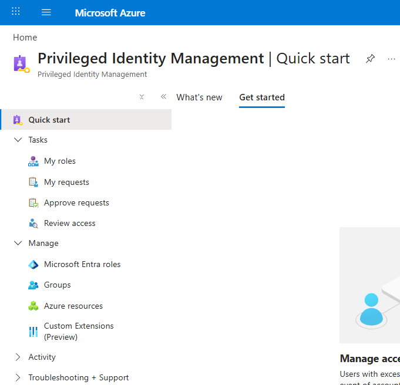
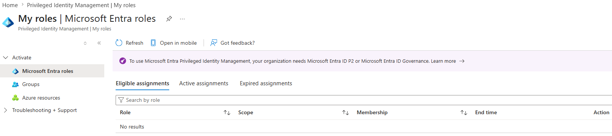
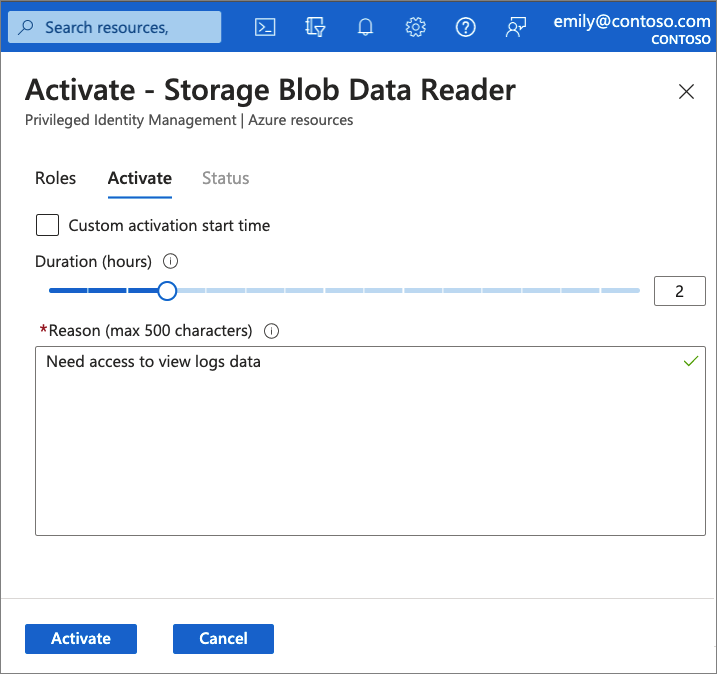

# Activate a Microsoft Entra PIM Role

## Overview

Microsoft Entra Privileged Identity Management (PIM) provides just-in-time access to privileged Azure roles.

Instead of assigning permanent administrative permissions, users activate eligible roles only when administrative access is required. This reduces standing privileges and improves the security of Azure environments.

---

## Step 1 - Open Privileged Identity Management

In the Azure portal, search for **Privileged Identity Management** and open the service.



---

## Step 2 - Open My Roles

Select **My roles** from the left navigation.

Depending on the type of role, choose one of the following tabs:

- **Azure resources** – Azure RBAC roles (for example Contributor or Owner)
- **Microsoft Entra roles** – Microsoft Entra ID administrative roles (for example Global Reader or User Administrator)

Eligible roles are displayed under **Eligible assignments**.



---

## Step 3 - Activate the Role

Locate the required role and select **Activate**.

Depending on your organization's configuration, you may need to provide:

- Business justification
- Activation duration
- Ticket or change request number
- Multi-Factor Authentication (MFA)
- Approval by another administrator

After submitting the request, the role becomes active immediately or after approval.



---

## Verify the Activation

After activation:

1. Refresh the Azure portal if necessary.
2. Verify that the role appears under **Active assignments**.
3. Navigate to the Azure resource.
4. Confirm that the required permissions are available.

---

## Common Activation Requirements

Depending on the organization's PIM configuration, activation may require:

- Multi-Factor Authentication (MFA)
- Business justification
- Ticket or change request number
- Approval workflow
- Limited activation duration

---

## Typical Workflow

```text
Eligible Role
      │
      ▼
Activate
      │
      ▼
MFA
      │
      ▼
Business Justification
      │
      ▼
Approval (optional)
      │
      ▼
Active Role
      │
      ▼
Perform Administrative Tasks
      │
      ▼
Role Expires Automatically
```

---

## Best Practices

- Activate privileged roles only when required.
- Request the shortest activation duration that meets your needs.
- Provide meaningful business justifications.
- Verify that the role is active before performing administrative tasks.
- Allow the role to expire automatically after completing your work.
