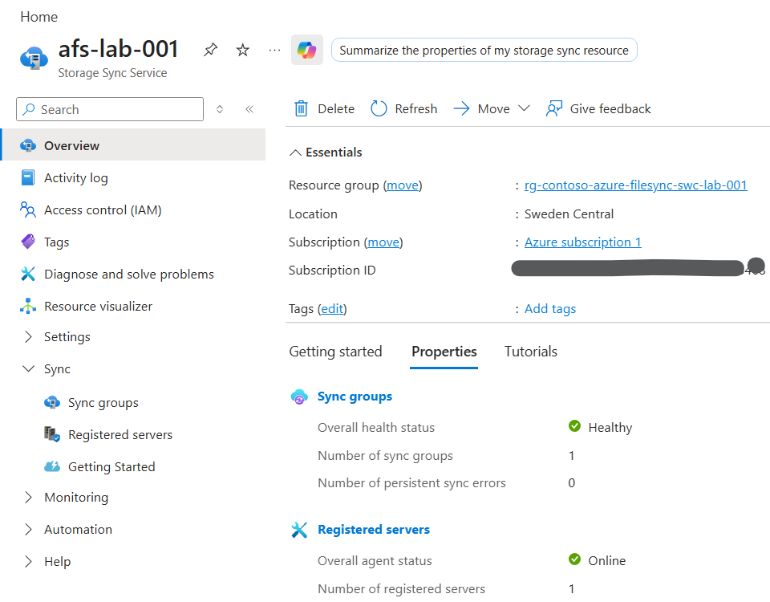
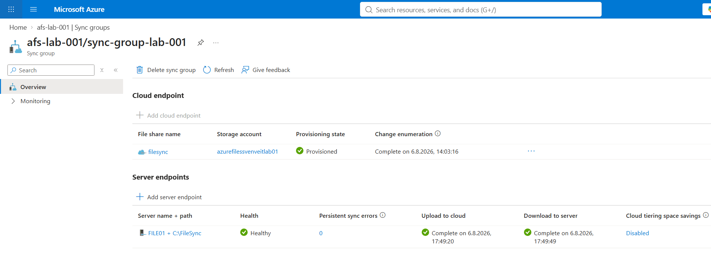
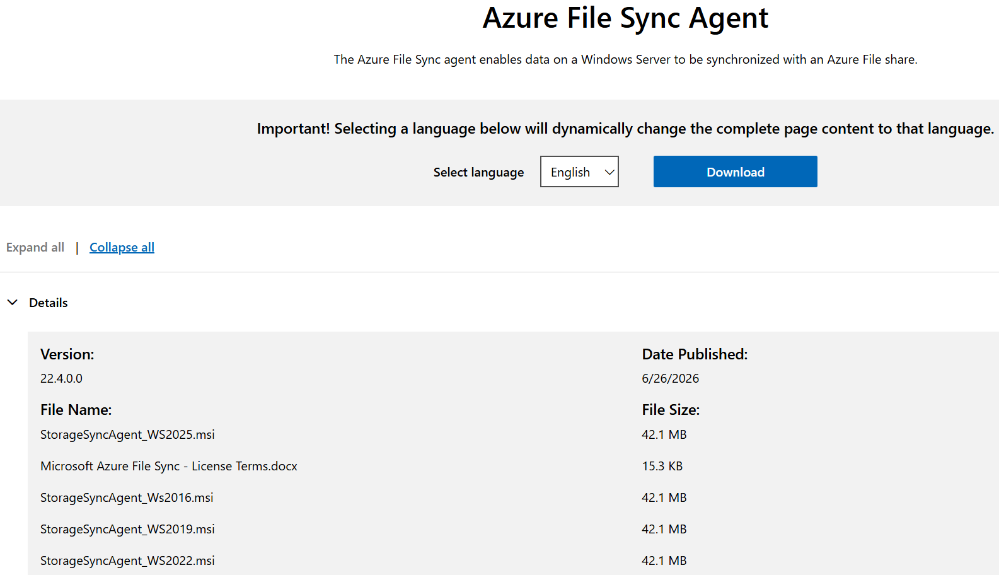
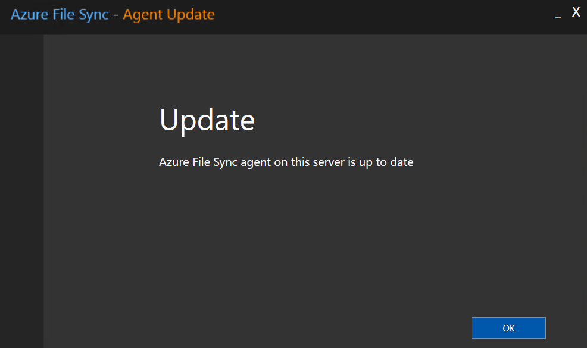
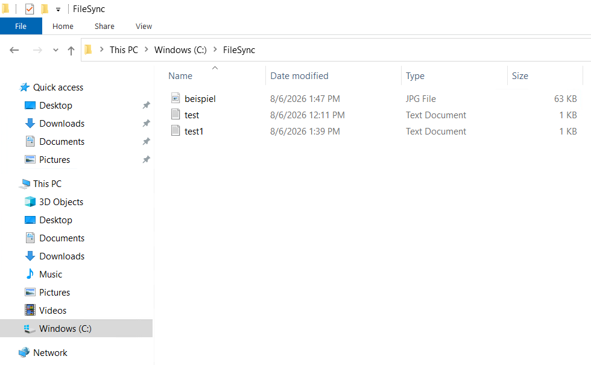
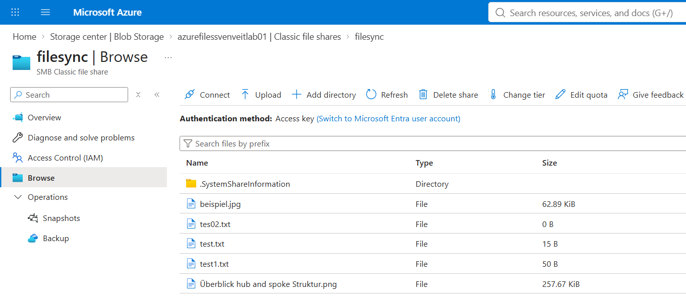

# Configure Azure File Sync

## Overview

This guide describes how to deploy Azure File Sync and connect a Windows Server to an Azure File Share.

The following components are configured:

- Storage Sync Service
- Sync Group
- Cloud Endpoint
- Azure File Sync Agent
- Server Registration
- Server Endpoint

---

# Step 1 - Create a Storage Sync Service

In the Azure portal, create a new **Storage Sync Service**.

Configure the following settings:

- Subscription
- Resource Group
- Name
- Region

After the deployment has completed, open the Storage Sync Service.



The Storage Sync Service is the central management resource for Azure File Sync. It stores the synchronization configuration and manages registered servers and sync groups.

---

# Step 2 - Create a Sync Group

Open the Storage Sync Service.

Navigate to:

**Sync groups**

↓

**Create**

Provide the following information:

- Sync Group name
- Storage Account
- Azure File Share

The Azure File Share becomes the **Cloud Endpoint** of the Sync Group.



A Sync Group connects one Azure File Share with one or more Windows Servers.

---

# Step 3 - Download the Azure File Sync Agent

Download the latest Azure File Sync Agent from Microsoft.



Install the version that matches your Windows Server operating system.

---

# Step 4 - Install the Azure File Sync Agent

Run the installer on the Windows Server.

Complete the installation using the default settings.

After installation, verify that the Azure File Sync Agent has been installed successfully.



The installation automatically starts the Server Registration wizard.

---

# Step 5 - Register the Windows Server

Sign in using an Azure account.

Select:

- Subscription
- Resource Group
- Storage Sync Service

Complete the registration.

The Windows Server now appears under **Registered servers** in the Storage Sync Service.

> Screenshot:
>
> Registered Server

The registration establishes the trust relationship between the Windows Server and the Storage Sync Service.

---

# Step 6 - Create a Server Endpoint

Return to the Sync Group.

Select:

**Add server endpoint**

Choose:

- Registered Server
- Local path

Example:

```text
C:\FileSync
```



Optionally configure Cloud Tiering.

Create the Server Endpoint.

The local folder is now connected to the Azure File Share.

---

# Step 7 - Verify Synchronization

Create a test file in the local folder.

Example:

```text
C:\FileSync\test.txt
```

After a short time, verify that the file appears in the Azure File Share.



Also verify that the Sync Group reports a healthy status.


If both checks are successful, Azure File Sync has been configured correctly.

---

# Next Steps

The next article describes common issues that may occur during deployment and how to troubleshoot them.
