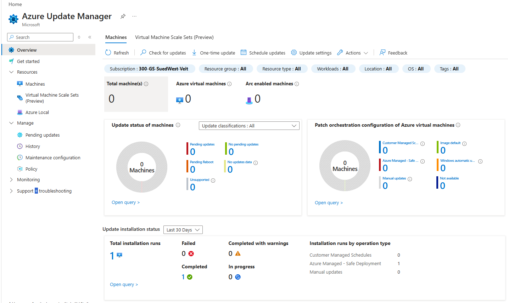

# Azure Update Manager

## Overview

Azure Update Manager is a centralized Azure service for managing operating system updates of Azure Virtual Machines, Azure Arc-enabled servers, and Virtual Machine Scale Sets.

It enables organizations to assess missing updates, schedule recurring maintenance windows, install operating system updates, and monitor update compliance from a single interface.

*Azure Update Manager – Overview*

## Supported Resources

Azure Update Manager supports:

- Azure Virtual Machines
- Azure Arc-enabled Servers
- Virtual Machine Scale Sets (Preview)

## Core Features

Azure Update Manager provides the following capabilities:

- Assess missing operating system updates
- Install updates on demand
- Configure recurring maintenance windows
- Create Maintenance Configurations
- Automatically assign resources using Dynamic Scopes
- Configure update orchestration
- Monitor update compliance
- Review update history

## Azure Update Manager Components

The following components are commonly used together when implementing Azure Update Manager.

| Component | Description |
|----------|-------------|
| AutomaticByPlatform | Enables Azure Update Manager to orchestrate operating system updates. |
| Maintenance Configuration | Defines maintenance windows, update classifications, reboot behavior, and schedules. |
| Customer Managed Schedules | Allows customers to define their own maintenance windows instead of using Azure-managed deployments. |
| Dynamic Scopes | Automatically assigns Maintenance Configurations to resources based on filters such as subscriptions, resource groups, locations, operating systems, or tags. |
| Azure Policy | Supports governance and automated assignment of update configurations. |
| Monitoring & Reporting | Provides update compliance, pending updates, installation history, and reporting capabilities. |

## Typical Configuration Workflow

A typical Azure Update Manager deployment consists of the following steps:

1. Configure the virtual machine for Azure Update Manager.
2. Create a Maintenance Configuration.
3. Configure the maintenance schedule.
4. Select the required update classifications.
5. Configure reboot behavior.
6. Create a Dynamic Scope.
7. Assign virtual machines automatically.
8. Monitor update compliance and installation history.

The following articles describe each configuration step in detail.

| Article | Description |
|---------|-------------|
| Maintenance Configurations | Create and configure recurring maintenance windows. |
| Dynamic Scopes | Automatically assign Maintenance Configurations to resources. |
| Customer Managed Schedules | Configure customer-defined maintenance schedules. |
| Azure Policies | Configure governance and policy-based assignments. |
| Monitoring & Reporting | Review update compliance, pending updates, and installation history. |
| Azure Virtual Desktop | Azure Update Manager considerations for Windows 10/11 Multi-Session environments. |

## Related Microsoft Documentation

- Azure Update Manager
- Maintenance Configurations
- Dynamic Scopes
- Azure Policy
