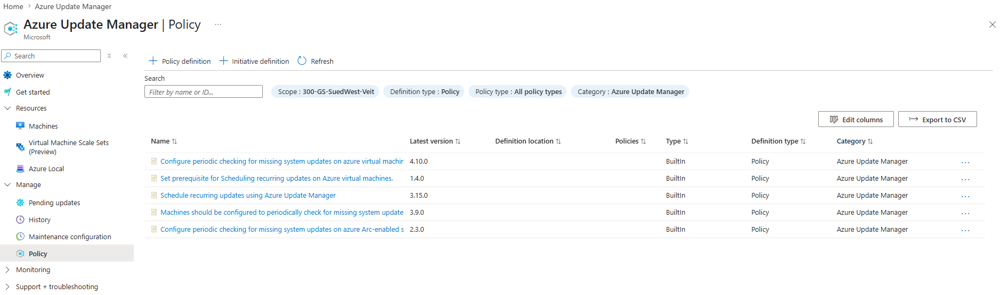
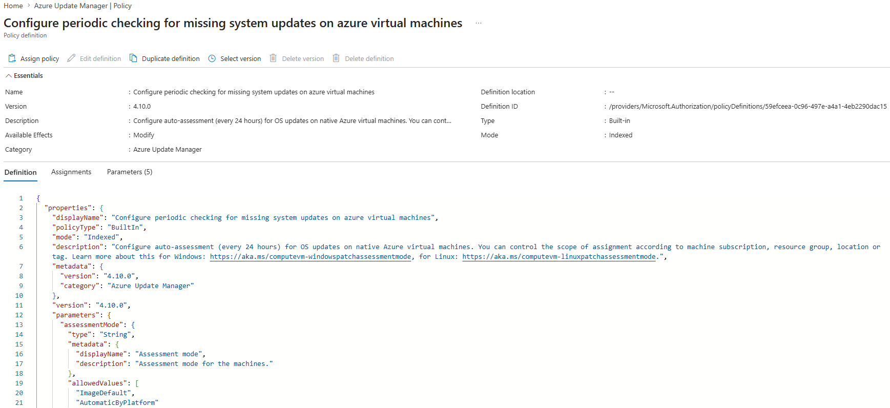

# Azure Policies

Azure Update Manager integrates with **Azure Policy** to automate update management and ensure a consistent configuration across Azure Virtual Machines and Azure Arc-enabled servers.

Instead of configuring every virtual machine individually, Azure Policies can automatically deploy required settings, monitor compliance, and enforce organizational standards.

Azure Update Manager currently provides **five built-in Azure Policies**, each targeting a different aspect of update management.

*Azure Update Manager – Built-in Azure Policies*

---

# Why use Azure Policies?

Azure Policies provide centralized governance for Azure Update Manager.

Typical use cases include:

- Enable periodic update assessments automatically
- Configure patch orchestration settings
- Automatically assign Maintenance Configurations
- Continuously monitor update compliance
- Standardize update management across multiple subscriptions

Using Azure Policies significantly reduces manual administration and ensures newly deployed virtual machines are configured consistently.

---

# Understanding an Azure Policy

Before assigning a policy, it is helpful to understand the information contained within a policy definition.

Every Azure Policy consists of a definition that describes:

- what should be evaluated
- what action should be taken
- which resources are affected
- which parameters can be configured

*Azure Update Manager – Built-in Policy Definition*

---

## Policy Definition

A policy definition contains several important properties.

| Property | Description |
|----------|-------------|
| Display Name | Human-readable policy name shown in Azure Portal. |
| Description | Explains the purpose of the policy. |
| Version | Version of the built-in policy definition. |
| Category | Groups related policies (Azure Update Manager). |
| Parameters | Values that can be customized during assignment. |
| Effect | Defines how Azure evaluates or enforces compliance. |

---

## Policy Effects

One of the most important properties of every Azure Policy is its **effect**.

The effect determines how Azure processes non-compliant resources.

Azure Update Manager primarily uses the following policy effects.

| Effect | Description | Managed Identity Required |
|---------|-------------|---------------------------|
| **AuditIfNotExists** | Reports non-compliant resources without making any changes. | No |
| **Modify** | Changes supported resource properties to achieve compliance. | Yes |
| **DeployIfNotExists** | Deploys missing configuration automatically. | Yes |

Policies using **Modify** or **DeployIfNotExists** require a Managed Identity because Azure must make changes to existing resources.

---

## Parameters

Many Azure Update Manager policies expose configurable parameters.

Typical parameters include:

- Assessment Mode
- Operating System
- Azure Region
- Azure Tags
- Resource Groups

Parameters allow a single built-in policy to be reused for different environments without modifying the policy definition itself.

---

## JSON Definition

Every Azure Policy is ultimately stored as a JSON document.

The JSON definition contains:

- metadata
- policy rules
- parameters
- effects
- role definitions (if required)

Understanding the JSON structure is generally not required when using built-in policies, but it can be helpful when troubleshooting or developing custom Azure Policies.

---

# Azure Update Manager Built-in Policies

Azure Update Manager currently provides five built-in policy definitions.

Each policy addresses a different aspect of update management.

| Policy | Effect | Recommendation |
|---------|--------|----------------|
| Configure periodic checking for missing system updates on Azure virtual machines | Modify | Recommended |
| Set prerequisite for Scheduling recurring updates on Azure virtual machines | DeployIfNotExists | Required when using Customer Managed Schedules |
| Schedule recurring updates using Azure Update Manager | DeployIfNotExists | Optional |
| Machines should be configured to periodically check for missing system updates | AuditIfNotExists | Recommended |
| Configure periodic checking for missing system updates on Azure Arc-enabled servers | Modify | Recommended for Azure Arc |

---

# Configure periodic checking for missing system updates on Azure virtual machines

## Purpose

Configures Azure Virtual Machines to periodically assess missing operating system updates.

Assessment results are displayed in Azure Update Manager and form the basis for update compliance reporting.

Without periodic assessments, Azure Update Manager cannot accurately determine which updates are missing.

### Policy Effect

**Modify**

### Typical Use Case

Enable automatic update assessments for Azure Virtual Machines managed by Azure Update Manager.

### Recommendation

Recommended for all Azure Virtual Machines.

---

# Set prerequisite for Scheduling recurring updates on Azure virtual machines

## Purpose

Configures Azure Virtual Machines to use **AutomaticByPlatform** as the patch orchestration mode.

This is a prerequisite for using **Customer Managed Schedules** through Azure Update Manager.

Without this configuration, Maintenance Configurations cannot control patch installation.

### Policy Effect

**DeployIfNotExists**

### Managed Identity

Required.

### Typical Use Case

Required whenever Azure Update Manager Maintenance Configurations should control patch installation.

### Recommendation

Recommended whenever Customer Managed Schedules are used.

---

# Schedule recurring updates using Azure Update Manager

## Purpose

Automatically assigns an existing Maintenance Configuration to Azure Virtual Machines.

Instead of assigning Maintenance Configurations manually, Azure Policy continuously evaluates compliance and deploys missing assignments automatically.

### Policy Effect

**DeployIfNotExists**

### Managed Identity

Required.

### Typical Use Case

Large environments where Maintenance Configurations should be assigned automatically.

### Recommendation

Recommended for larger environments using Azure Policy as part of their governance strategy.

---

# Machines should be configured to periodically check for missing system updates

## Purpose

Audits whether virtual machines are configured to perform periodic update assessments.

Unlike the previous policy, this policy only reports compliance and does not modify resources.

### Policy Effect

**AuditIfNotExists**

### Typical Use Case

Compliance reporting and governance.

### Recommendation

Recommended for environments that regularly review Azure Policy compliance.

---

# Configure periodic checking for missing system updates on Azure Arc-enabled servers

## Purpose

Enables periodic update assessments for Azure Arc-enabled servers.

Functionally, this policy corresponds to the Azure Virtual Machine assessment policy but targets Azure Arc resources.

### Policy Effect

**Modify**

### Typical Use Case

Azure Arc-enabled Windows or Linux servers.

### Recommendation

Recommended whenever Azure Arc-enabled servers are managed through Azure Update Manager.
