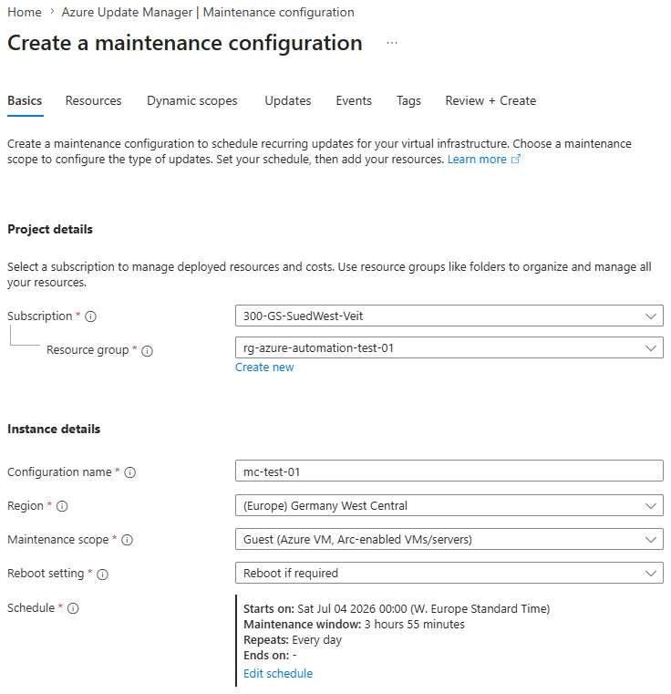
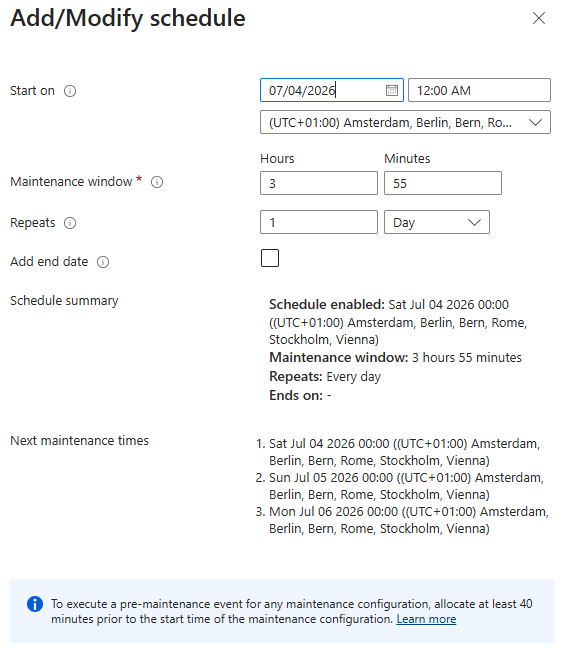
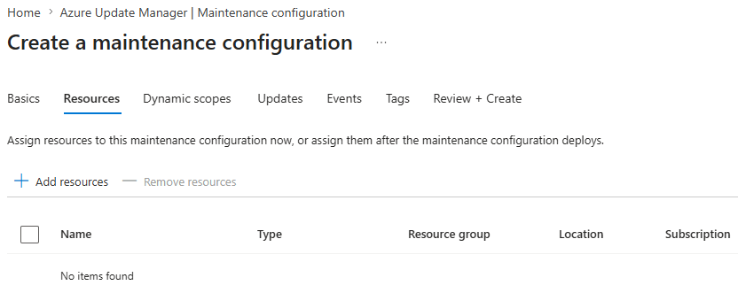
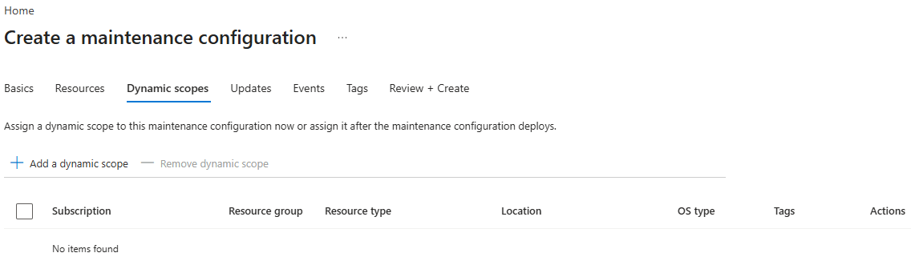
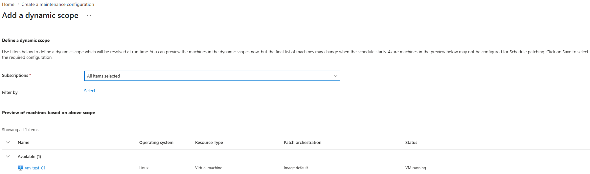
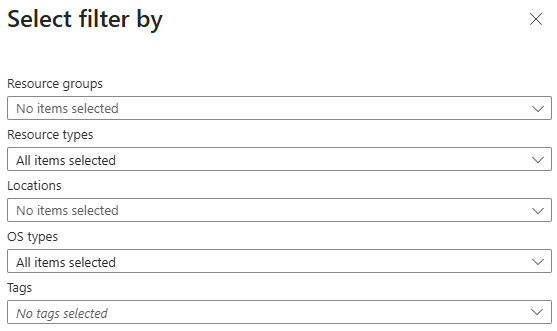
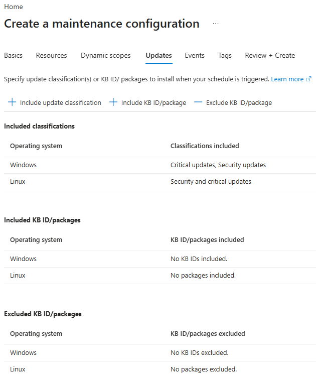
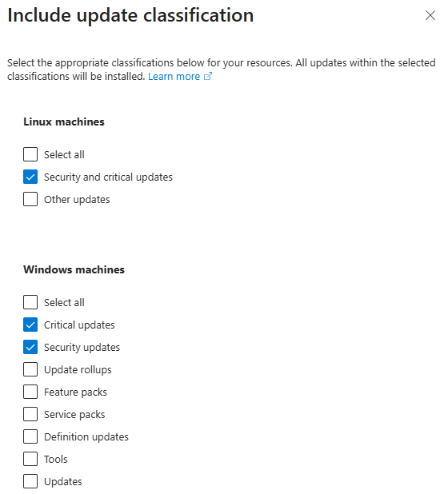
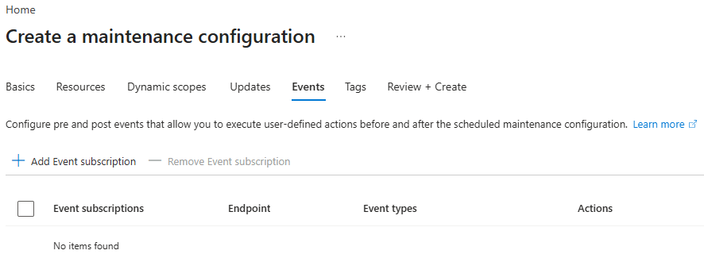

# Basics

The **Basics** tab defines the fundamental settings of a Maintenance Configuration. These settings determine which resources can be managed, how Azure Update Manager handles operating system restarts, and when maintenance is allowed to take place.

Most of the important design decisions are made in this step. Choosing the appropriate maintenance scope, reboot behavior, and maintenance schedule is essential for a successful patch management strategy.



*Maintenance Configuration – Basics*

---

## Configuration Name

Choose a descriptive and consistent name for the Maintenance Configuration.

A clear naming convention simplifies administration, especially when multiple maintenance configurations are used for different environments, operating systems, or maintenance strategies.

Examples:

- `mc-securityupdates-ring1`
- `mc-securityupdates-ring2`
- `mc-featureupdates-ring1`
- `mc-featureupdates-ring2`

- `mc-patch-pilot`
- `mc-patch-test`
- `mc-patch-production`

Using meaningful names also makes it easier to identify Maintenance Configurations when configuring Dynamic Scopes or reviewing update history.

---

## Region

A Maintenance Configuration is an Azure resource and therefore must be deployed to an Azure region.

In most environments, the same region as the remaining management resources is selected. The region of the Maintenance Configuration does **not** have to match the region of the virtual machines that will later be assigned to it.

---

## Maintenance Scope

The **Maintenance Scope** determines which type of Azure resources can be managed by the Maintenance Configuration.

For operating system patch management, the following option should be selected:

**Guest (Azure VM, Arc-enabled VMs/servers)**

This scope supports:

- Azure Virtual Machines
- Azure Arc-enabled servers

The remaining maintenance scopes are intended for specific Azure platform maintenance scenarios.

| Scope | Description | Typical Use Case |
|--------|-------------|------------------|
| **Guest** | Manages operating system updates inside the virtual machine. | Azure Virtual Machines and Azure Arc-enabled servers |
| **Host** | Performs maintenance on the underlying Azure host infrastructure. | Azure Dedicated Hosts |
| **OS Image** | Updates the operating system image of a Virtual Machine Scale Set. | Virtual Machine Scale Sets |
| **Resource** | Performs maintenance on supported Azure platform resources. | Azure services supporting planned maintenance |

> **Best Practice**
>
> The **Guest** maintenance scope is the standard choice for Windows and Linux virtual machines. It provides full operating system patch management through Azure Update Manager.

---

## Reboot Setting

The **Reboot setting** determines how Azure Update Manager handles operating system restarts after installing updates.

Selecting the appropriate reboot behavior is important, as some updates are only fully applied after the operating system has restarted.

| Option | Description | Typical Use Case |
|--------|-------------|------------------|
| **Reboot if required** | Restarts the virtual machine only if an installed update requires a reboot. | Recommended for most production environments. |
| **Never reboot** | Installs updates without performing an automatic restart. Any required reboot must be completed manually or by another automation process. | Environments where application owners control restarts. |
| **Always reboot** | Restarts the virtual machine after every maintenance run, regardless of whether it is required. | Test environments or dedicated maintenance scenarios. |

> **Best Practice**
>
> **Reboot if required** provides the best balance between operational stability and security. Unnecessary restarts are avoided while ensuring that updates requiring a reboot are completed successfully.

---

## Schedule

The maintenance schedule defines **when** Azure Update Manager is allowed to install updates.

Select **Edit schedule** to configure the maintenance window.



*Maintenance Configuration – Schedule*

The following schedule settings can be configured:

| Setting | Description |
|---------|-------------|
| **Start time** | Defines when the first maintenance window begins. |
| **Time zone** | Specifies the time zone used for the maintenance schedule. |
| **Maintenance window** | Defines how long Azure Update Manager may install updates. |
| **Recurrence** | Determines how often the maintenance window is repeated (Daily, Weekly or Monthly). |
| **End date** | Optionally limits the maintenance schedule to a specific period. |

### Maintenance Window

The maintenance window should be long enough to allow Azure Update Manager to:

- Assess available updates
- Download update packages
- Install operating system updates
- Restart the virtual machine if required
- Complete post-reboot update operations

For production environments, maintenance windows between **2 and 4 hours** are commonly used, depending on the operating system, expected update volume, and reboot duration.

### Recurrence

Azure Update Manager supports recurring maintenance schedules.

Available options include:

- Daily
- Weekly
- Monthly

The selected recurrence depends on the organization's patch management strategy.

Typical examples include:

- **Weekly** for development or test environments.
- **Monthly** for production environments following Microsoft's monthly Patch Tuesday release cycle.

---

# Resources

The **Resources** tab allows Azure resources to be assigned directly to the Maintenance Configuration.

Resources added in this step will automatically participate in every maintenance window defined by the configuration.



*Maintenance Configuration – Resources*

---

## Direct Resource Assignment

Select **Add resources** to manually assign resources to the Maintenance Configuration.

Depending on the selected maintenance scope, Azure Update Manager supports assigning:

- Azure Virtual Machines
- Azure Arc-enabled servers
- Additional supported Azure resources

After the Maintenance Configuration has been created, all assigned resources automatically participate in the configured maintenance schedule.

---

## When to use Direct Assignments

Direct resource assignments are suitable for environments where only a small number of virtual machines need to be managed.

Typical scenarios include:

- Test and development environments
- Proof of Concepts (PoCs)
- Individual virtual machines
- Temporary maintenance configurations

Since every resource must be added manually, administrative effort increases as the environment grows.

---

## Dynamic Scopes

Instead of assigning virtual machines individually, Azure Update Manager also supports **Dynamic Scopes**.

Dynamic Scopes automatically assign resources based on filter criteria such as:

- Subscription
- Resource Group
- Region
- Operating System
- Resource Type
- Tags

This approach eliminates the need to manually maintain resource assignments whenever new virtual machines are deployed.

Dynamic Scopes are configured in the next step of the Maintenance Configuration wizard.

---

## Choosing the Right Assignment Method

| Assignment Method | Advantages | Typical Use Case |
|-------------------|------------|------------------|
| **Direct Resource Assignment** | Simple configuration for a small number of resources. | Test environments, PoCs, individual virtual machines. |
| **Dynamic Scopes** | Automatic resource assignment based on filters. Scales automatically as the environment grows. | Production environments and large Azure deployments. |

---

## Best Practice

For production environments, **Dynamic Scopes** are generally preferred over manual resource assignments.

Using Dynamic Scopes together with Azure Tags enables virtual machines to be assigned automatically as they are deployed, reducing administrative effort and minimizing the risk of missing systems during future maintenance windows.

---

# Dynamic Scopes

A **Dynamic Scope** automatically assigns Azure resources to a Maintenance Configuration based on predefined filter criteria.

Instead of manually maintaining a list of virtual machines, Azure Update Manager evaluates the configured filters whenever a maintenance run is executed. All matching resources are automatically included in the maintenance window.

This approach significantly reduces administrative effort and ensures that newly deployed resources are automatically managed without modifying the Maintenance Configuration.



*Maintenance Configuration – Dynamic Scopes*

---

## Create a Dynamic Scope

Select **Add a dynamic scope** to create a new assignment.



*Create a Dynamic Scope*

At least one Azure subscription must be selected. Additional filter criteria can then be configured to narrow the scope of the assignment.

---

## Available Filter Options

Dynamic Scopes support several filter criteria that can be combined as required.



*Available filter options*

| Filter | Description | Typical Use Case |
|---------|-------------|------------------|
| **Subscription** | Limits the scope to one or more Azure subscriptions. | Organizations managing multiple subscriptions. |
| **Resource Groups** | Includes only resources from selected resource groups. | Separate maintenance windows for applications or environments. |
| **Resource Types** | Filters specific Azure resource types. | Target only Azure Virtual Machines. |
| **Locations** | Includes resources deployed in selected Azure regions. | Regional maintenance schedules. |
| **OS Types** | Filters Windows or Linux operating systems. | Separate maintenance windows for Windows and Linux servers. |
| **Tags** | Includes resources based on Azure Tags. | Patch rings, environments, business units or application ownership. |

Multiple filters can be combined to create highly granular maintenance scopes.

For example:

- All Windows virtual machines
- Located in **West Europe**
- Inside the **Production** resource group
- Tagged with **PatchRing = Ring1**

---

## Using Azure Tags

Azure Tags are one of the most powerful filter options and are commonly used to implement automated patch management.

Example:

| Tag | Example Values |
|-----|----------------|
| Environment | Production, Test, Development |
| PatchRing | Ring1, Ring2 |
| SecurityUpdates | withRESTART, withoutRESTART |
| FeatureUpdates | Ring1, Ring2 |

Using tags allows administrators to organize maintenance independently of the Azure resource structure.

For example, virtual machines from different subscriptions or resource groups can still share the same maintenance configuration simply by assigning the same tag.

This also simplifies onboarding new virtual machines, as only the required tags need to be assigned.

---

## Preview

Before saving the Dynamic Scope, Azure displays a preview of all matching resources.

The preview should always be reviewed to verify that the configured filters return the expected virtual machines.

This helps identify configuration errors before the Maintenance Configuration is applied.

---

## Best Practices

For production environments, Dynamic Scopes are generally preferred over manual resource assignments.

Some common recommendations include:

- Use Azure Tags whenever possible.
- Keep the tagging strategy consistent across the environment.
- Use separate tags for different maintenance strategies (for example Security Updates and Feature Updates).
- Verify the resource preview before saving the Dynamic Scope.
- Avoid overly complex filter combinations unless required.

---

# Updates

The **Updates** tab defines which operating system updates are installed during the maintenance window.

Azure Update Manager supports selecting updates based on **update classifications**. Additionally, individual Windows Knowledge Base (KB) updates or Linux packages can be explicitly included or excluded.

This allows organizations to implement both broad patch management strategies and targeted update deployments.



*Maintenance Configuration – Updates*

---

## Update Classifications

Select **Include update classifications** to choose which update categories should be installed during each maintenance window.



*Available update classifications*

Azure Update Manager uses the native update classifications provided by Windows Update and the Linux package manager.

### Windows Update Classifications

| Classification | Description | Recommendation |
|---------------|-------------|----------------|
| **Critical Updates** | Fix critical issues that are not security related but affect system stability or reliability. | Recommended |
| **Security Updates** | Resolve known security vulnerabilities. | Strongly recommended |
| **Update Rollups** | Bundled collections of previously released updates. | Recommended |
| **Definition Updates** | Update Microsoft Defender and other security definitions. | Recommended |
| **Updates** | General operating system updates that do not belong to another classification. | Evaluate based on organizational requirements |
| **Feature Packs** | Introduce additional Windows features or functionality. | Deploy separately after validation |
| **Service Packs** | Large cumulative update packages used by older Windows versions. | Only if applicable |
| **Tools** | Microsoft tools distributed through Windows Update. | Usually not required |

### Linux Update Classifications

| Classification | Description | Recommendation |
|---------------|-------------|----------------|
| **Security and Critical Updates** | Security fixes and critical operating system updates. | Strongly recommended |
| **Other Updates** | All remaining package updates. | Evaluate based on maintenance strategy |

---

## Recommended Update Strategy

For production environments, a staged deployment approach is generally recommended.

A common strategy includes:

### Security Maintenance Window

Install:

- Security Updates
- Critical Updates
- Definition Updates
- Update Rollups

These updates typically address vulnerabilities, improve system stability and should be deployed regularly.

### Feature Maintenance Window

Deploy:

- Feature Packs
- Other non-security related updates

Feature-related updates often introduce new functionality and may require additional validation before deployment.

Separating security and feature updates reduces operational risk while ensuring that critical security patches are installed as quickly as possible.

---

## Include KB ID / Package

The **Include KB ID / Package** option allows individual Windows KB updates or Linux packages to be installed regardless of the selected update classifications.

Typical scenarios include:

- Deploying a specific security fix.
- Testing a newly released update.
- Installing an update outside the normal maintenance cycle.

Examples:

Windows

- KB5035857
- KB5036892

Linux

- kernel
- openssh
- nginx

This option is primarily intended for exceptional situations rather than routine patch management.

---

## Exclude KB ID / Package

The **Exclude KB ID / Package** option prevents specific Windows KB updates or Linux packages from being installed.

Typical scenarios include:

- A known compatibility issue with an application.
- An update that has caused operational problems.
- Temporary exclusion while awaiting a corrected release from Microsoft or the software vendor.

Excluded updates are ignored even if they belong to one of the selected update classifications.

---

## Best Practices

When configuring update classifications:

- Install security-related updates regularly.
- Separate security updates from feature updates whenever possible.
- Use Include/Exclude KBs only for temporary exceptions.
- Review update classifications periodically as operating system requirements evolve.
- Validate feature updates before deploying them to production systems.

---

# Events

The **Events** tab allows Azure Update Manager to publish events before and after a maintenance window.

These events are delivered through **Azure Event Grid** and can be used to trigger automated workflows, notifications, or operational tasks.

For environments that require additional automation, Event Grid enables Azure Update Manager to integrate with services such as Azure Functions, Logic Apps, Azure Automation, Service Bus, or custom webhooks.



*Maintenance Configuration – Events*

---

## Event Subscriptions

Select **Add Event subscription** to create an Event Grid subscription for the Maintenance Configuration.

Azure Update Manager supports two event types:

- **Pre-maintenance**
- **Post-maintenance**

Each event can trigger one or more downstream services through Azure Event Grid.

---

## Pre-maintenance Events

A **Pre-maintenance** event is published before the maintenance window begins.

Typical use cases include:

- Notify administrators about an upcoming maintenance window.
- Gracefully stop business applications or services.
- Temporarily disable monitoring alerts.
- Drain Azure Virtual Desktop session hosts.
- Create snapshots or backups before patch installation.

> **Note**
>
> Microsoft recommends scheduling pre-maintenance actions at least **40 minutes** before the maintenance window to allow sufficient time for automation tasks to complete.

---

## Post-maintenance Events

A **Post-maintenance** event is published after the maintenance process has completed.

Typical use cases include:

- Notify administrators that maintenance has finished.
- Re-enable monitoring or alerting.
- Start previously stopped services.
- Execute health checks or validation scripts.
- Trigger follow-up automation or reporting.

---

## Typical Architecture

A common implementation is shown below.

```text
Azure Update Manager
        │
        ▼
Azure Event Grid
        │
        ├── Azure Function
        ├── Azure Logic App
        ├── Azure Automation
        ├── Azure Service Bus
        └── Webhook
```

This event-driven approach enables maintenance activities to be integrated into existing operational processes without manual intervention.

---

## When to use Event Subscriptions

Event subscriptions are optional.

They are particularly useful when maintenance windows require additional automated actions before or after patch installation.

Typical scenarios include:

- Enterprise environments
- Business-critical applications
- Automated operational workflows
- Integration with ITSM or monitoring platforms

Smaller environments often do not require Event subscriptions and can use Azure Update Manager without additional automation.

---

## Summary

At this point, the Maintenance Configuration is fully configured.

The configuration defines:

- The maintenance scope
- The maintenance schedule
- Resource assignment
- Dynamic Scopes
- Update classifications
- Optional event-driven automation

After deployment, Azure Update Manager executes the maintenance configuration according to the defined schedule and automatically applies it to all assigned resources.
